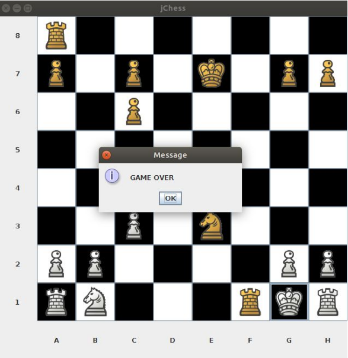
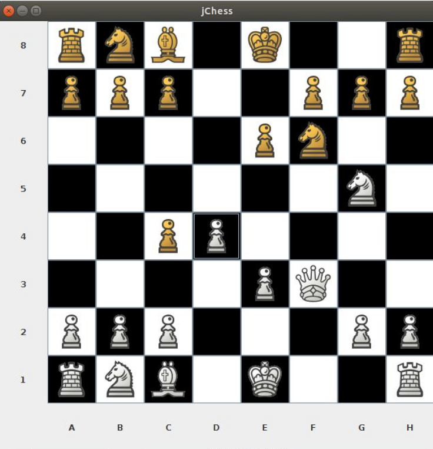

# JChess
A very basic Chess game, made entirely in Java. Also includes an intermediate-level AI to play against.

### Some samples from a real game
 - JChess Engine (BLACK) successfully able to checkmate a human opponent (WHITE).
    

 - JChess Engine (BLACK) smartly defending against human player’s (WHITE) attempt on a Scholar’s Check-Mate.
    